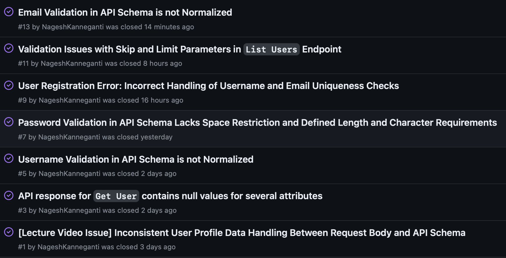
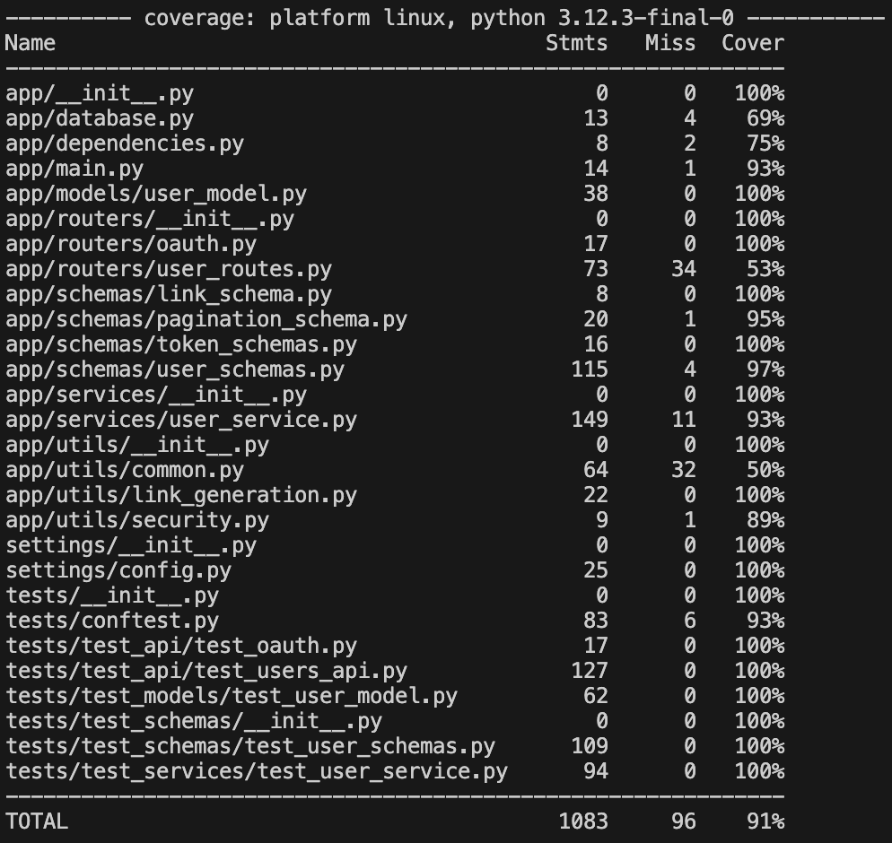
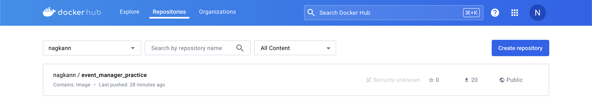
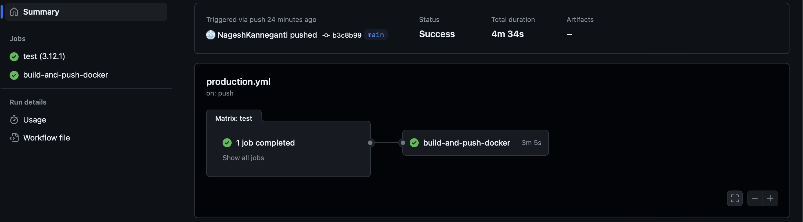

# Homework 10
#### Event Manager Company: Software QA Analyst/Developer Onboarding Assignment
<br>

> NOTE: Each Issue has a link to the `Closed Issue` (with documentation), `Pull Request` (with documentation), and `Code Changes` (with test code). 

## Summary of Issues:


## Closed Issues
1. API response for `Get User` contains null values for several attributes
#### Issue Description
> [Closed Issue #1](https://github.com/NageshKanneganti/event_manager_practice/issues/3)
```markdown
## Endpoint - POST / get / Get User

### __Description__
__Full Name, Bio, and Profile Picture URL__: Returned as null in the API responses despite being populated in the database. This inconsistency leads to confusion and limits the API's usability.

### *Examples*
**Current Behavior**:
- When retrieving user data by UUID, fields such as `full_name`, `bio`, and `profile_picture_url` are returned as null despite being available in the database:
  ```json
  {
    "username": "john_doe_123",
    "email": "john.doe@example.com",
    "full_name": null,
    "bio": null,
    "profile_picture_url": null,
    "id": "5c6ec320-b4ab-4882-823f-99d05c3a21f0",
    "last_login_at": "2024-04-17T14:44:56.400335Z",
    "created_at": "2024-04-17T14:43:16.652593Z",
    "updated_at": "2024-04-17T14:44:56.401548Z",
    "links": [
      {
        "rel": "self",
        "href": "http://localhost/users/5c6ec320-b4ab-4882-823f-99d05c3a21f0",
        "action": "view",
        "type": "application/json"
      },
      {
        "rel": "update",
        "href": "http://localhost/users/5c6ec320-b4ab-4882-823f-99d05c3a21f0",
        "action": "update",
        "type": "application/json"
      },
      {
        "rel": "delete",
        "href": "http://localhost/users/5c6ec320-b4ab-4882-823f-99d05c3a21f0",
        "action": "delete",
        "type": "application/json"
      }
    ]
  }

**Expected Behavior**:
- The response should accurately reflect all available user data, including full_name, bio, and profile_picture_url if they are present in the database.
- The API should ensure consistency and reliability in delivering complete user information as per the stored data.
- Proper documentation and schema definitions should be updated to reflect the actual data handling and serialization processes.
```

#### Pull Request: Updated `UserResponse` model for `get_user`
> [Code Changes for issue #1](https://github.com/NageshKanneganti/event_manager_practice/pull/4/files)
```markdown
This pull request enhances API consistency and reliability in delivering complete user information as per the stored data.
```
<br>

2. Username Validation in API Schema is not Normalized
#### Issue Description
> [Closed Issue #2](https://github.com/NageshKanneganti/event_manager_practice/issues/5)
```markdown
## Endpoint - *POST / register / Register*

### __Description__
#### __Issue Summary__
Identify discrepancies in `username` between the API's actual behavior and the expected uniqueness constraints defined in the schema. The schema is intended to enforce username normalization to avoid case sensitivity issues, but the current implementation does not adhere to these rules.

#### __Current Behavior__
- The API allows the creation of usernames that differ only in case, such as "john_doe_123" and "John_Doe_123".

#### __Expected Behavior__
- The API should enforce normalization of usernames to treat them in a case-insensitive manner. This enforcement would ensure data consistency and prevent potential issues related to data handling and storage.
```

#### Pull Request: Normalized `username` and enhanced parameters.
> [Code Changes for issue #2](https://github.com/NageshKanneganti/event_manager_practice/pull/6/files)
```markdown
Normalized `username` and enhnaced validation parameters. 
```
<br>

3. Password Validation in API Schema Lacks Space Restriction and Defined Length and Character Requirements
#### Issue Description
> [Closed Issue #3](https://github.com/NageshKanneganti/event_manager_practice/issues/7)
```markdown
## Endpoint - *POST / register / Register*

### __Description__
#### __Issue Summary__
The current password validation for user registration in the FastAPI application allows passwords with spaces and has no maximum length constraint.

#### __Current Behavior__
- Passwords can include spaces.
- There is no maximum length set for passwords.

#### __Expected Behavior__
- Passwords should not contain spaces to enhance security measures and ensure data integrity.
- Passwords should have a maximum length to prevent potential security vulnerabilities associated with excessively long passwords.
```

#### Pull Request: Enhanced Password Validation Rules for User Registration
> [Code Changes for issue #3](https://github.com/NageshKanneganti/event_manager_practice/pull/8/files)
```markdown
### Description
#### Issue Summary
Implemented enhanced password validation rules in the `UserCreate` schema to improve security measures for user registration. These enhancements include checks for password length, character types, and format requirements.

#### Changes Made
- **Password Length**: Enforced a maximum of 255 characters.
- **Start With a Letter**: Added a validation rule requiring that passwords start with a letter.
- **No Spaces**: Included a validation to reject passwords containing spaces.

#### Expected Behavior
- Passwords not meeting the length requirements should trigger a validation error indicating that they are either too short or too long.
- Passwords missing required character types (uppercase, lowercase, digit, special character) should be rejected with an appropriate error message.
- Passwords starting with characters other than letters or containing spaces should be invalidated with specific error messages.

#### Purpose
These changes are intended to align with best security practices, ensuring that user credentials are robust against common security threats. These improvements also aim to standardize password formats for better system consistency and security.
```
<br>

4. User Registration Error: Incorrect Handling of Username and Email Uniqueness Checks
#### Issue Description
> [Closed Issue #4](https://github.com/NageshKanneganti/event_manager_practice/issues/9)
```markdown
## Endpoint - POST / register / Register

### Description:
#### Issue Summary
- The user registration process incorrectly handles checks for username and email uniqueness. When attempting to register with either an existing username or email, the system fails to differentiate between these two errors properly, often misleadingly reporting that a username is taken when, in fact, the email might be the issue.

#### Current Behavior
- The system consistently reports that the username already exists, even if the actual conflict may be with the email. This leads to confusion and potentially multiple failed attempts by the user to register.

#### Expected Behavior
- The system should clearly indicate whether the username, the email, or both are already taken, providing specific error messages for each scenario.

#### Steps to Reproduce
1. Attempt to register a new user with a username that does not exist in the database but using an email that does.
2. Observe the error message returned by the system.
3. Attempt to register a new user with an email that does not exist in the database but using a username that does.
4. Observe the error message returned by the system.
```

#### Pull Request: Updated `UserResponse` model for `register`
> [Code Changes for issue #4](https://github.com/NageshKanneganti/event_manager_practice/pull/10/files)
```markdown
### Description
#### Summary
Updated register function HTTPException message to accurately reflect error message when trying to register with a duplicate username or email on the spec page. 

#### Changes Made
- __HTTPException__: Updated detail to "Username and/or Email already exist"
- Added test for duplicate email

#### Expected Behavior
- The system should clearly indicate if Username and/or Email already exist when trying to register.

```
<br>

5. Validation Issues with Skip and Limit Parameters in `List Users` Endpoint
#### Issue Description
> [Closed Issue #5](https://github.com/NageshKanneganti/event_manager_practice/issues/11)
```markdown
## Endpoint - GET / users / List Users

### Description:
#### Issue Summary
- The List Users endpoint in the API does not properly validate the `skip` and `limit` parameters, resulting in incorrect HTTP 200 OK responses under conditions where HTTP 400 Bad Request responses are expected. Specifically, the endpoint does not handle negative values for `skip` and `limit` correctly, nor does it handle cases where the `skip` value exceeds the total number of available users. This can lead to potential confusion for API consumers who may receive empty lists without clear indication that their input parameters were out of acceptable bounds.

#### Current Behavior
- Returns a 200 OK status even if `skip` is negative or `limit` is zero or negative.
- Returns a 200 OK with an empty list, which may not clearly inform the client that the `skip` value is too high rather than there being no data.

#### Expected Behavior
- The endpoint should return a 400 Bad Request for `skip` values < 0 or `limit` values <= 0 or > 10.
- Consider returning a specific message or status code when `skip` exceeds the number of available users, indicating no more data is available.
```

#### Pull Request: Refined Pagination with Enhanced Skip and Limit Validation for `List Users` endpoint
> [Code Changes for issue #5](https://github.com/NageshKanneganti/event_manager_practice/pull/12/files)
```markdown
### Description

**Issue Summary:**

Previously, the `list_users` endpoint did not enforce strict validation on the `skip` and `limit` parameters, leading to potential errors and inefficiencies in data retrieval. Users could request unrealistic data ranges, resulting in unnecessary load and potential errors from the database.

**Changes Made:**
- **Skip and Limit Validation**: Implemented strict numerical range checks for both `skip` and `limit` parameters. 
  - **Skip**: Must be between 0 and 10.
  - **Limit**: Restricted to values between 1 and 10.
  - If `skip` or `limit` parameters are out of the allowed range, the endpoint now returns a 400 error with a specific message explaining the issue.

**Expected Behavior:**
- This validation ensures that API responses are predictable and that user requests are within a manageable scope.

**Purpose:**
The refinement of the `skip` and `limit` parameters is aimed at enhancing the performance and reliability of the `list_users` endpoint. By enforcing these constraints, the API becomes more robust against erroneous or malicious data requests, aligns better with best practices in API design, and ensures that the system remains stable and responsive under various user load scenarios.
```
<br>

6. Email Validation in API Schema is not Normalized
#### Issue Description
> [Closed Issue #6](https://github.com/NageshKanneganti/event_manager_practice/issues/13)
```markdown
## Endpoint - POST / register / Register

### Description
#### Issue Summary
The current implementation of email validation in our user registration process lacks normalization and specific format enforcement. This leads to potential inconsistencies and security concerns, such as the acceptance of emails with variable capitalization and non-standard domains.

#### Issues Identified:
1. Email Normalization: The system treats emails with different cases (e.g., "john.doe@example.com" vs. "John.Doe@example.com") as distinct, which can lead to duplicate accounts for the same actual email address.
2. Domain Restriction: Our current validation does not restrict email addresses to a specific domain ending, such as ".com". This could lead to accepting less common or potentially problematic domains.
```

#### Pull Request: Normalized and validated `email` input at `Register` endpoint
> [Code Changes for issue #6](https://github.com/NageshKanneganti/event_manager_practice/pull/14/files)
```markdown
### Description

**Issue Summary:**
- Previously, the `Register` endpoint did not enforce strict validation on the `email`. It was possible to have two very similar user accounts because of Case-sensitive emails: John.Doe@example.com and john.doe@example.com. This practice conflicts with tradition email registration producers as most organizers normalize emails. 

**Changes Made:**
1. Implement Email Normalization: Convert all incoming email addresses to lowercase before validation and storage to prevent case-sensitive duplicates.
2. Enforce Specific Domain Endings: Update the validation logic to ensure that all email addresses end with "`.com`, `.org`, `.edu`, `.net`, `.gov` ", reflecting our primary user base and reducing the risk of accepting less standard email formats.

These changes aim to enhance the security and consistency of user data in our application. By enforcing rules, we can avoid common issues like duplicate user accounts due to case insensitivity and ensure our data conforms to expected standards, thus improving the overall robustness of our user management processes.

**Purpose:**

Implementing these changes will improve our system's reliability in handling user registrations and ensure that our user database remains clean and efficient. This will also help in reducing user confusion and support overhead related to account management.
```
<br>

## Lecture Issue

#### Issue Description
> Link to [Closed Issue](https://github.com/NageshKanneganti/event_manager_practice/issues/1)
```markdown
## Endpoint - POST / register / Register

### __Description__
1. __Profile Picture URL__: The schema uses different default URLs in various models, leading to potential confusion and inconsistency in how user data is presented and expected.
2. __Bio Content__: The schema provides a default bio that does not match the actual usage and examples provided in the request.
3. [__Address professors lecture issue__] - Schema body should match response body

### _Examples_
**Current Behavior**:
- The schema body specifies a profile picture URL that differs from the one received in the API request (`jane_smith.jpg` vs. `john_doe.jpg`).
- Bio descriptions in schema examples do not match those used in API requests.

**Expected Behavior**:
- The schema should consistently represent the same URLs and bio content as those used and expected in API requests.
- All examples and default values in the schema should accurately reflect real use cases.
```

#### Pull Request: Enhance URL Validation and Extend Tests for UserBase Model
> Link to [Code Changes](https://github.com/NageshKanneganti/event_manager_practice/pull/2/files)
```markdown
This pull request introduces enhanced validation for the *profile_picture_url* field in the `UserBase` model to ensure that:
1. The URL does not exceed 255 characters
2. The URL meets format requirements (HTTPS/HTTP and file extension checks). 

Additional tests have been added to verify that these new validations effectively catch errors related to excessive length and incorrect URL formats.

[Addressed Issue in Professors Lecture Video] Updated schemas for `UserBase` and `UserCreate` and added tests to check if schema body matches API response body.
```
<br>

## Reflective Summary
*What I learned from this assignment*
<br>

## Coverage Report


## Dockerhub


## GitHub Actions


## Grading Rubric

| Criteria                                                                                                                | Points |
|-------------------------------------------------------------------------------------------------------------------------|--------|
| Resolved 5 issues related to username validation, password validation, and profile field edge cases                      | 30     |
| Resolved the issue demonstrated in the instructor video                                                                 | 20     |
| Increased test coverage to 90% by writing comprehensive test cases                                                      | 20     |
| Followed collaborative development practices using Git and GitHub (branching, pull requests, code reviews)              | 15     |
| Submitted a well-organized GitHub repository with clear documentation, links to closed issues, and a reflective summary | 15     |
| **Total**                                                                                                               | **100**|
